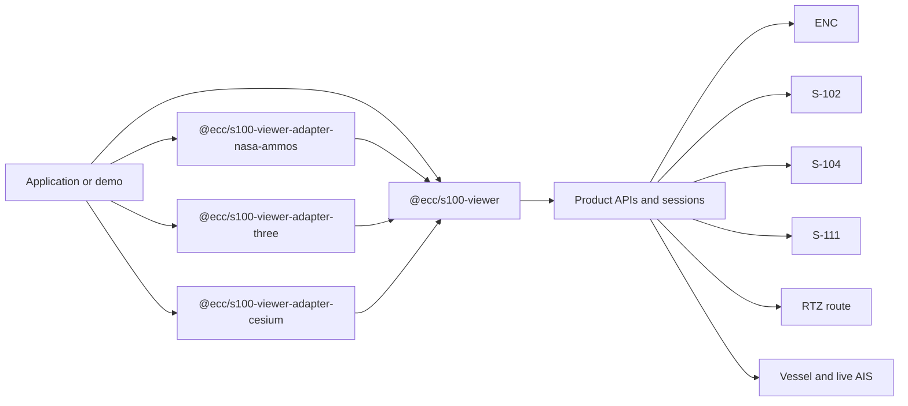
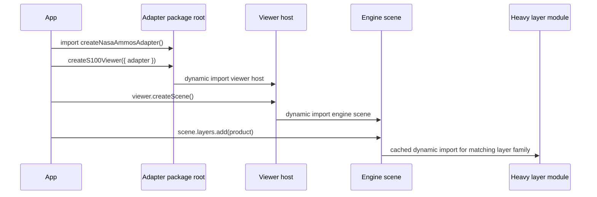

# New Features After The Interoperability Refactor

Status: `ecc-lib-maintainability`

Package baseline: `@ecc/s100-viewer@0.1.0-alpha.12`

This document summarizes the major feature work that landed in `ecc-s100-lib`
after the interoperability refactor baseline. It is intentionally not a deep
maintainability note. The companion architecture documents explain why the code
was split and how package boundaries are guarded. This file focuses on what a
library user can now do, which public APIs are involved, and which demos verify
the behavior.

## Scope

The reference point for this overview is the feature state after the
interoperability refactor and the `0.1.0-alpha.9` package baseline. The
`ecc-lib-maintainability` branch then brought in the parametric vessel branch,
the RTZ route branch, the maintainability phases, and the later AIS and S-104
feature work.

The short version:

- the core package now has feature-level entrypoints for product workflows;
- parametric vessels can be generated from dimensions instead of GLB models;
- live AIS-like vessel feeds can create and update parametric fleets;
- RTZ routes can be parsed, laid out, and portrayed with curved turns and 3D
  corridor geometry;
- a plain Three.js reference adapter exists alongside NASA-AMMOS and Cesium;
- S-104 water-level data can be decoded, sampled, attached to the scene, and
  used by terrain and vessel rendering;
- the engine switcher demo is now the broad integration testbed for these
  features.

## Feature Map

| Feature | Main public import | Primary API | Verified by |
| --- | --- | --- | --- |
| Feature-level entrypoints | `@ecc/s100-viewer/products/*` | Product-specific barrels for ENC, S-102, S-104, S-111, route, vessel, simulated water level | `npm run maintainability:check`, demo builds |
| Parametric vessel model | `@ecc/s100-viewer/products/vessel` | `buildParametricVesselLayout`, `normalizeParametricVesselSpec`, `VesselFeatureSession` | `npm run demo:parametric-vessel`, engine switcher vessel scenes |
| Live AIS vessel feed | `@ecc/s100-viewer/products/vessel` | `createLiveVesselFeedLayer`, `createProjectedLiveAisPositionMapper`, `LiveAisVessel` | engine switcher `Live AIS Norway`, S-100 Explorer AIS tab |
| RTZ route portrayal | `@ecc/s100-viewer/products/route` | `parseRtzRoute`, `RouteFeatureSession`, `RouteStyles.s421Hybrid3d` | `npm run demo:rtz-route`, engine switcher route scenes |
| Three.js reference adapter | `@ecc/s100-viewer-adapter-three` | `createThreeAdapter` | `npm run demo:engine-switcher` |
| S-104 water level | `@ecc/s100-viewer/products/s104` | `S104Workflow`, `createS104WaterLevelSampler`, `scene.waterLevel` | `npm run demo:s104-fixture-service`, engine switcher `S-104 Water Level`, S-100 Explorer Water Level tab |
| S-102 positive depth and water-level shading | `@ecc/s100-viewer/products/s102` | `safetyDepthMeters`, `depthFromElevation`, adapter water-level terrain shading | S-102 scenes in engine switcher and S-100 Explorer |
| S-111 workflow orchestration | `@ecc/s100-viewer/products/s111` | `S111Workflow.prepare`, `S111Workflow.addPreparedLayers`, `S111Workflow.configureSceneTime` | engine switcher `S-111 Currents` |
| Bundle-aware adapter loading | adapter package roots | lazy viewer, scene, and heavy layer modules | `npm run bundle-shape:check` |

## Current Package Model

The active runtime package set is centered on the engine-neutral core package
plus renderer adapters:

- `@ecc/s100-viewer`
- `@ecc/s100-viewer-adapter-nasa-ammos`
- `@ecc/s100-viewer-adapter-cesium`
- `@ecc/s100-viewer-adapter-three`

`@ecc/s100-viewer-adapter-three` is a plain Three.js reference adapter. It is
useful for API validation and adapter-authoring work, but is not part of
`tools/release-targets.mjs` yet. NASA-AMMOS remains the main advanced browser
renderer used by S-100 Explorer. Cesium remains a shipped adapter for
globe-native experiments and engine switching, but the S-100 Explorer webapp is
not expected to import Cesium directly.

The Cogs adapter is outside the active feature line. It can still be preserved
for reference, but new feature work should target the core package, NASA-AMMOS,
Three, and Cesium where appropriate.



## Feature-Level Entrypoints

The root package remains valid and convenient for viewer setup:

```ts
import {
  LayerBuilder,
  SceneBuilder,
  createS100Viewer,
} from "@ecc/s100-viewer";
```

Feature code should now prefer product entrypoints:

```ts
import { S111Workflow } from "@ecc/s100-viewer/products/s111";
import { S104Workflow } from "@ecc/s100-viewer/products/s104";
import { RouteFeatureSession } from "@ecc/s100-viewer/products/route";
import { VesselFeatureSession } from "@ecc/s100-viewer/products/vessel";
```

These entrypoints are important for developer ergonomics and bundle hygiene:

- product modules can import only the types, builders, and sessions they need;
- examples and apps have a clearer place to import product behavior from;
- maintainability checks can detect accidental cross-product coupling;
- bundlers have narrower static graphs to analyze.

The available public product entrypoints are:

- `@ecc/s100-viewer/products`
- `@ecc/s100-viewer/products/enc`
- `@ecc/s100-viewer/products/s102`
- `@ecc/s100-viewer/products/s104`
- `@ecc/s100-viewer/products/s111`
- `@ecc/s100-viewer/products/route`
- `@ecc/s100-viewer/products/vessel`
- `@ecc/s100-viewer/products/simulated-water-level`

Application code should avoid `@ecc/s100-viewer/internal/*`. That export exists
for controlled workspace use and adapter implementation, not as an app-level
contract.

## Bundle-Aware Adapter Loading

The maintainability branch also changed the adapter loading shape. Adapter
package roots are now small public shells, and heavy scene or layer modules are
loaded lazily when they are actually needed.



This matters for applications that only use part of the library. A module that
only creates a vessel feed should not accidentally pull in every route,
S-111, S-104, or terrain implementation through static imports.

The check command is:

```sh
npm run bundle-shape:check
```

It is also included in:

```sh
npm run maintainability:check
```

## Parametric Vessel Model

The vessel product can now create vessel geometry from dimensions. This is used
for live AIS fleets and for demos where a GLB is unnecessary.

Main entrypoint:

```ts
import {
  VesselFeatureSession,
  buildParametricVesselLayout,
  normalizeParametricVesselSpec,
  type ParametricVesselSpec,
} from "@ecc/s100-viewer/products/vessel";
```

The model is designed around AIS-style dimensions:

- `bow`: distance from transponder/GNSS reference point to the bow;
- `stern`: distance from the reference point to the stern;
- `port`: distance from the reference point to port side;
- `starboard`: distance from the reference point to starboard side;
- `draught`: positive nautical depth downward from the waterline.

The generated layout includes:

- hull bow, midship, and stern parts;
- deck outline;
- bridge;
- mast;
- transponder marker;
- derived dimensions and bounds;
- metadata that can travel with the layer.

Example:

```ts
const spec: ParametricVesselSpec = {
  kind: "parametric",
  template: "generic-cargo",
  dimensions: {
    bow: 78,
    stern: 22,
    port: 9,
    starboard: 11,
    draught: 6.5,
  },
  metadata: {
    source: "manual-demo",
    vesselId: "demo-1",
  },
};

const session = await VesselFeatureSession.add({
  scene,
  id: "demo-parametric-vessel",
  parametric: spec,
  pose: {
    position: {
      kind: "projected",
      crs: "EPSG:32631",
      x: 654390.818,
      y: 6542760.725,
      z: 0,
    },
    headingDegrees: 35,
  },
  style: {
    showSeaLevelIndicator: true,
    showOceanSurface: true,
    shadow: {
      enabled: true,
      mode: "high-quality",
    },
  },
});
```

Important behavior added during this branch:

- positive draught is the public convention;
- hull height is derived from beam and draught when not provided;
- bridge height is clamped to a sensible proportion of hull height;
- mast height is clamped to a sensible proportion of hull height;
- the vessel pose uses CRS-aware `Coordinate` objects;
- sessions expose `getPosition()`, `setPosition()`, `getHeading()`,
  `setHeading()`, `setDimensions()`, visibility, transform mode, ocean-surface,
  and sea-level indicator controls;
- NASA-AMMOS and Three support transform gizmos for translated and rotated
  vessels.

The focused demo is:

```sh
npm run demo:parametric-vessel
npm run check:demo:parametric-vessel
npm run build:demo:parametric-vessel
```

## Live AIS Vessel Feed

The live vessel feed is the library surface for taking normalized AIS-like
reports and turning them into managed parametric vessel layers.

Main entrypoint:

```ts
import {
  createLiveVesselFeedLayer,
  createProjectedLiveAisPositionMapper,
  type LiveAisVessel,
} from "@ecc/s100-viewer/products/vessel";
```

The feed controller owns the repetitive app work:

- create a vessel layer for a new MMSI;
- update pose, heading, and dimensions for an existing MMSI;
- remove missing or stale vessels;
- apply a selected-vessel style;
- expose selected vessel details through `getVessel(mmsi)`;
- dispose all generated vessel sessions cleanly.

Example:

```ts
const feed = await createLiveVesselFeedLayer({
  scene,
  id: "live-ais",
  stalePolicy: {
    maxAgeSeconds: 300,
    removeMissing: true,
  },
  positionMapper: createProjectedLiveAisPositionMapper({
    crs: "EPSG:32631",
  }),
  style: {
    style: {
      opacity: 0.92,
      showSeaLevelIndicator: true,
      showOceanSurface: false,
      shadow: {
        enabled: true,
        mode: "shared-texture",
        opacity: 0.34,
      },
    },
    selectedStyle: {
      opacity: 1,
    },
  },
});

await feed.updateVessels(vesselsFromProxy);
await feed.selectVessel(257000000);

const selected = feed.getVessel(257000000);
```

`LiveAisVessel` preserves provider details that are useful in an app sidebar:

- MMSI;
- name;
- call sign;
- IMO number;
- report class;
- ship type;
- navigational status;
- speed/course/heading;
- message time;
- source stream;
- dimensions;
- draught.

When the provider does not report draught, the library estimates it from vessel
beam and records that the draught is estimated. This keeps the display honest:
the app can show that the value was not provided by AIS.

The AIS proxy itself is not part of `@ecc/s100-viewer`. It is a backend/service
boundary because provider credentials must not be exposed to browser code. The
library receives normalized `LiveAisVessel` objects and manages rendering and
selection after that boundary.

The broad manual tests are:

```sh
npm run demo:engine-switcher
```

Select the `Live AIS Norway` recipe. With a configured `VITE_AIS_PROXY_URL`, the
demo fetches AIS data, places vessels in the Stavanger projected-local scene,
uses AIS A/B/C/D dimensions where available, and renders shared terrain shadows
for the AIS fleet.

## AIS Fleet Shadows

The branch added a lightweight shadow mode for many parametric AIS vessels:

```ts
style: {
  shadow: {
    enabled: true,
    mode: "shared-texture",
    opacity: 0.34,
  },
}
```

The intent is different from the single high-quality GLB demo vessel shadow:

- one or a few hero vessels can keep high-quality per-vessel shadow handling;
- AIS fleets use a cheaper shared/stamped terrain-shadow path;
- the shadow stamp follows the hull footprint rather than a large circular
  blob;
- terrain receivers should be shaded directly where the adapter supports it,
  instead of placing large flat shadow planes in the water.

NASA-AMMOS currently reports `visualFeatures.vesselShadow: true` and implements
this path for the advanced terrain scene. Three can render parametric AIS
vessels but currently advertises `vesselShadow: false`.

## RTZ Route Support

RTZ route support moved from app/demo-specific logic into the route product
surface.

Main entrypoint:

```ts
import {
  RouteFeatureSession,
  RouteStyles,
  parseRtzRoute,
} from "@ecc/s100-viewer/products/route";
```

The route product now owns:

- RTZ XML parsing;
- waypoint defaults;
- leg extraction;
- turn-radius handling;
- route geodesy helpers;
- route-plan layout;
- XTD corridor geometry;
- curved turn transitions;
- hybrid 2D/3D route volume presentation;
- route session lifecycle and cleanup.

Minimal RTZ loading:

```ts
const routes = RouteFeatureSession.create({ scene });

await routes.addRtz({
  id: "pilot-route",
  source: {
    kind: "url",
    url: "/routes/pilot-route.rtz",
  },
});
```

Hybrid 3D portrayal:

```ts
await routes.addRtz({
  id: "pilot-route-3d",
  source: {
    kind: "file",
    file,
  },
  style: RouteStyles.s421Hybrid3d({
    showRouteVolume: true,
    showRouteSides: true,
    showTurnDebugGeometry: false,
  }),
});
```

The route demo exercises the parser, sample RTZ file, route upload, S-102
bathymetry scene alignment, route summaries, and 3D volume portrayal:

```sh
npm run demo:rtz-route
npm run check:demo:rtz-route
npm run build:demo:rtz-route
```

## Three.js Reference Adapter

The branch brought in the local Three.js adapter worktree and adapted it to the
current package boundaries.

Main entrypoint:

```ts
import { createThreeAdapter } from "@ecc/s100-viewer-adapter-three";
```

The Three adapter is useful because it is a plain implementation over a widely
known generalist browser 3D engine. It is not intended to replace NASA-AMMOS as
the main advanced renderer, but it gives the project an adapter that is easier
to inspect as a reference implementation.

Current feature coverage includes:

- projected-local scenes;
- z-up runtime orientation;
- camera pose and look-at controls;
- WMS/template ENC overlays;
- S-102 3D Tiles terrain;
- S-111 arrows;
- parametric vessels;
- vessel ocean surface visualization;
- vessel transform gizmo;
- RTZ route layers;
- S-104 sampled water-level field;
- per-position water-level terrain shading;
- shared shader definitions for S-100 terrain and current portrayal where
  applicable.

The engine switcher demo is the main validation surface:

```sh
npm run demo:engine-switcher
```

Switch between `NASA-AMMOS`, `Three.js`, and `Cesium` to compare rendering of
the same public S-100 layer specs. This is how the branch verified ENC overlays,
S-102 safety shading, S-111 glyphs, S-104 water-level sampling, vessel pose,
ocean surface orientation, and RTZ route geometry across adapters.

## S-104 Water Level

S-104 is now its own IHO product feature, separate from the older
`simulated-water-level` helper. This is important because generated water-level
fixtures and simple scalar water-level demos are not the same thing as real
S-104 product support.

Main entrypoint:

```ts
import {
  S104Workflow,
  createFixtureS104Service,
  createS104WaterLevelSampler,
  sampleS104WaterLevel,
  type S104WaterLevelSampler,
} from "@ecc/s100-viewer/products/s104";
```

The implemented S-104 stack includes:

- regular-grid metadata assessment;
- S-104-shaped JSON dataset decoding;
- fill/no-data handling;
- nearest-neighbor spatial lookup;
- nearest-record temporal lookup;
- dataset status reporting;
- prepared dataset summaries;
- merged timeline metadata;
- observed grid metadata;
- a reusable `S104WaterLevelSampler`;
- scene-level `scene.waterLevel` controller;
- adapter forwarding of sampled water-level field state;
- per-position S-102 terrain shading in NASA-AMMOS and Three;
- point-specific vessel vertical behavior.

Core sampling example:

```ts
const workflowResult = await S104Workflow.prepare({
  datasets: [
    {
      id: "stavanger-generated-s104",
      title: "Generated Stavanger S-104 Fixture",
    },
  ],
  crs: "EPSG:32631",
  service: createFixtureS104Service({
    endpoint: "http://127.0.0.1:8794",
  }),
  limits: {
    maxDataPoints: 500000,
    metadataFetchConcurrency: 1,
    dataFetchConcurrency: 1,
  },
});

scene.waterLevel.setSampler(workflowResult.sampler);

const sample = scene.waterLevel.sample({
  coordinate: {
    kind: "projected",
    crs: "EPSG:32631",
    x: 654390.818,
    y: 6542760.725,
    z: 0,
  },
  time: new Date(workflowResult.timeline?.initialTime ?? Date.now()),
});
```

S-104 sampling semantics currently follow the initial IHO-aligned rules chosen
for the project:

- regular grid support first;
- nearest-neighbor spatial lookup;
- nearest-record temporal lookup;
- no interpolation or extrapolation by default;
- no shoreline-barrier or same-waterbody inference by default;
- no-data or outside-coverage samples are reported explicitly;
- scene/rendering integrations treat unavailable point data as no extra
  water-level effect above the baseline.

The fixture workflow exists because real S-104 HDF5 samples were not available
during the initial implementation. The fixture generator creates deterministic
S-104-shaped JSON with spatial phase shifts so water level varies across a
scene at the same time.

Fixture commands:

```sh
npm run fixtures:s104:generate
npm run fixtures:s104:validate
npm run demo:s104-fixture-service
```

The service demo exposes:

```text
http://127.0.0.1:8794/s104/catalog.json
```

The broad manual test is:

```sh
npm run demo:engine-switcher
```

Select `S-104 Water Level`. The demo combines generated S-104 fixture data,
Stavanger S-102 terrain, transparent ENC overlay, sample-point readouts, a demo
vessel, time controls, and adapter terrain shading.

## S-102 Positive Depth And Water-Level Terrain Shading

The public S-102 bathymetry style now follows nautical chart convention:
increasing positive values mean increasing depth.

Main entrypoint:

```ts
import {
  createS102,
  depthFromElevation,
  type S102LayerSpec,
} from "@ecc/s100-viewer/products/s102";
```

Relevant style:

```ts
const terrain = createS102({
  id: "s102-terrain",
  url: "https://example.test/s102/tileset.json",
  crs: "EPSG:32631",
  style: {
    safetyDepthMeters: 10,
  },
});
```

The branch extended this beyond static safety-depth shading:

- the scene can hold a sampled S-104 water-level field;
- adapters receive the active field state;
- NASA-AMMOS and Three report `waterLevelTerrainShading: "per-position"`;
- S-102 red unsafe/safe shading can vary horizontally as S-104 values vary
  across the scene;
- if no S-104 data exists at a location, the terrain falls back to zero extra
  water-level effect.

This is testable in both S-100 Explorer and the engine switcher S-104 scene by
scrubbing or playing the water-level time controls while observing the S-102
red safety shading.

## S-111 Workflow Orchestration

The S-111 product workflow is the reference pattern that S-104 now follows:
metadata assessment, bounded fetch concurrency, prepared layers, timeline
configuration, and scene time playback are owned by the library.

Main entrypoint:

```ts
import {
  S111Workflow,
  createPrimarS111Service,
} from "@ecc/s100-viewer/products/s111";
```

Engine switcher usage:

```ts
const workflowResult = await S111Workflow.prepare({
  datasets,
  crs: "EPSG:32619",
  service: createPrimarS111Service({
    endpoint,
    licenseeKey,
  }),
  limits: {
    dataFetchConcurrency: 2,
  },
  time: {
    interpolation: "nearest",
  },
  style: {
    renderer: "arrows",
    scale: "auto",
  },
});

await S111Workflow.addPreparedLayers(scene, workflowResult.prepared);
S111Workflow.configureSceneTime(scene, workflowResult.timeline, {
  play: true,
  loop: true,
  rate: 10,
});
```

The S-111 scene in the engine switcher defaults to looping playback so current
arrows animate immediately.

## ENC Overlay Improvements

ENC support continues to treat S-101 and S-57 as related ENC products with
common map-overlay behavior but different product identities.

Main entrypoint:

```ts
import {
  EncWmsSession,
  EncLayerBuilder,
  ProjectedMap,
} from "@ecc/s100-viewer/products/enc";
```

The post-refactor line tightened the intended usage:

- application code should use product sessions and layer builders instead of
  local WMS boilerplate;
- transparent overlays should preserve raster alpha correctly;
- projected-local WMS/template layers should refine to the expected tile density
  instead of leaving a low-resolution scene overlay stuck in view;
- S-101 and S-57 share common ENC controls such as opacity while preserving
  room for S-101-specific display parameters later.

This is testable in:

```sh
npm run demo:engine-switcher
```

Use the `Minimal`, `S-101 ENC`, `S-102 Terrain`, `S-111 Currents`,
`S-104 Water Level`, and `Live AIS Norway` recipes to confirm ENC overlay
resolution and transparency while other products are visible behind it.

## Scene Water-Level Controller

The scene API now has a first-class water-level field controller:

```ts
scene.waterLevel.setSampler(workflowResult.sampler);
const sampler = scene.waterLevel.getSampler();
const state = scene.waterLevel.getState();
const sample = scene.waterLevel.sample({ coordinate, time });
```

This keeps applications from needing to know how every adapter samples S-104 or
how to translate a water-level value into terrain and vessel behavior. The
application provides the prepared sampler; the scene and adapters consume it.

The controller reports one of these sources:

- `static`
- `simulated-water-level`
- `s104`

This is the key feature boundary:

- `simulated-water-level` remains useful for simple scalar demos;
- `s104` is used when a gridded, point-specific water-level field is active;
- renderers can still fall back to a representative scalar sea level when a
  feature cannot consume the full field.

## Coordinates And CRS-Aware Controller State

Controllers that expose positions now return CRS-aware `Coordinate` objects
instead of anonymous raw tuples. This addresses a major source of app-level
coordinate ambiguity.

Example:

```ts
const position = vessel.controllers.vessel.getPosition();

if (position.kind === "projected") {
  console.log(position.crs, position.x, position.y, position.z);
}
```

The `kind` discriminator is intentionally present even though TypeScript can
know narrower types in local code. These values cross runtime and adapter
boundaries, and the discriminator lets plain JavaScript, app handlers, tests,
serialized scenario data, and adapter code distinguish projected, geodetic,
ECEF, and local coordinates safely.

## Testing Through Demos

Use this matrix for manual verification.

| Demo | Command | Features covered |
| --- | --- | --- |
| Getting started | `npm run demo:getting-started` | Minimal viewer setup, public package imports |
| Reference app | `npm run demo:reference` | App structure, sessions, lifecycle, service setup |
| Parametric vessel | `npm run demo:parametric-vessel` | Parametric vessel dimensions, layout, transform controls |
| RTZ route | `npm run demo:rtz-route` | RTZ parser, curved turns, route volume, S-102 context |
| S-104 fixture service | `npm run demo:s104-fixture-service` | Local JSON fixture endpoint for S-104 workflow testing |
| Engine switcher | `npm run demo:engine-switcher` | NASA-AMMOS, Three, Cesium adapter comparison across products |

Use this matrix for automated validation.

| Purpose | Command |
| --- | --- |
| Release-target build | `npm run build` |
| Release-target type check | `npm run check` |
| Release-target tests | `npm run test` |
| Maintainability guardrails | `npm run maintainability:check` |
| Package dry run | `npm run pack:release-target:dry-run` |
| Three adapter check | `npm run check:adapter-three` |
| Three adapter tests | `npm run test:adapter-three` |
| Engine switcher build | `npm run build:demo:engine-switcher` |
| RTZ route build | `npm run build:demo:rtz-route` |
| Parametric vessel build | `npm run build:demo:parametric-vessel` |
| S-104 fixture validation | `npm run fixtures:s104:validate` |

For end-to-end local inspection of the newest feature stack, run:

```sh
npm run fixtures:s104:generate
npm run demo:s104-fixture-service
npm run demo:engine-switcher
```

Then select:

- `S-102 Terrain` for positive depth and terrain safety shading;
- `S-111 Currents` for animated current arrows;
- `S-104 Water Level` for spatially varying water level and terrain response;
- `Live AIS Norway` for live AIS vessels, A/B/C/D dimensions, selection, and
  fleet shadows on adapters that support fleet terrain shading;
- `Vessel` for GLB vessel model, ocean surface, shadow, and transform controls;
- `RTZ Route` or the standalone RTZ demo for route portrayal.

## External Service Boundaries

Some demos require local or external services. The feature belongs in the
library, but credentials and deployment do not.

| Boundary | Library owns | External/local service owns |
| --- | --- | --- |
| ENC WMS | Layer/session specs, alpha, projected map handling | WMS endpoint, license/config |
| S-102 3D Tiles | Layer specs, style, depth semantics | 3D Tiles endpoint |
| S-111 | Workflow, metadata assessment, prepared layers, playback | S-111 service endpoint and license/config |
| S-104 | Decoder, sampler, workflow, water-level field | Fixture or future real S-104 endpoint |
| Live AIS | Normalized vessel feed, parametric fleet rendering | Backend AIS proxy and provider credentials |

The engine switcher `.env.example` documents the current development variables.
Do not put provider secrets in client-side Vite environment variables.

## Commit-Level Feature Trace

The following commit groups explain where the features came from on the
`ecc-lib-maintainability` line. This is not a full changelog, but it gives
maintainers a useful map when they need to inspect implementation history.

| Commit group | Feature area |
| --- | --- |
| `4ea29c4` | Parametric vessel model and demo |
| `3668718`, `7a14567`, `2ffc24c`, `825aa10` | RTZ parser, layout, route session, NASA rendering, RTZ demo |
| `c1cc3a0` through `7399df2` | Phase 0 and 1 maintainability guardrails |
| `a522b9c` through `c014253` | Adapter boundary and NASA/Cesium runtime splits |
| `c31b814` through `c4413d1` | Shared product semantics, route/vessel splits, app/demo boundary tightening |
| `479813c` | Feature-level entrypoints and lazy adapter loading |
| `2081d0e` | Three reference adapter and shared S-100 shaders |
| `b8cb993` | Improved RTZ route portrayal geometry |
| `77a7991` | Three adapter vessel and environment support |
| `8eddd71`, `0812a70` | Live AIS vessel feed and fleet support |
| `640a052` through `71e3897` | S-104 foundation, fixtures, decoder, sampler, workflow, scene controller, adapters, terrain water-level support |

## Known Boundaries

These are intentional limits of the current feature state:

- generated S-104 fixtures are development fixtures, not conformance evidence;
- real S-104 HDF5 ingestion and production service integration are future work;
- S-104 currently uses nearest-neighbor spatial and temporal lookup;
- shoreline-aware or same-waterbody water-level lookup is not implemented;
- unavailable S-104 point data is treated as no extra water-level effect in
  rendering integrations;
- Three is still a reference adapter and may lag NASA-AMMOS in high-end visual
  features such as fleet terrain shadows;
- Cesium remains useful for engine switching but does not yet have full feature
  parity with NASA-AMMOS and Three in projected-local advanced scenes;
- Cogs is outside the current maintained adapter path.

## Related Documents

- [README](./README.md)
- [API entrypoints](./docs/api/entrypoints.md)
- [Maintainability refactor](./docs/architecture/maintainability-refactor.md)
- [S-104 water level architecture](./docs/architecture/s104-water-level.md)
- [Live AIS vessel feed workflow](./docs/workflows/live-vessel-feed.md)
- [Parametric vessel workflow](./docs/workflows/parametric-vessel.md)
- [RTZ route workflow](./docs/workflows/rtz-route.md)
- [Engine switcher learning guide](./docs/learn/engine-switcher-practical-guide.md)
