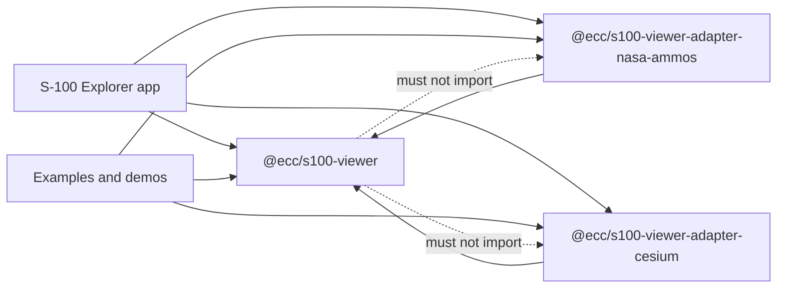
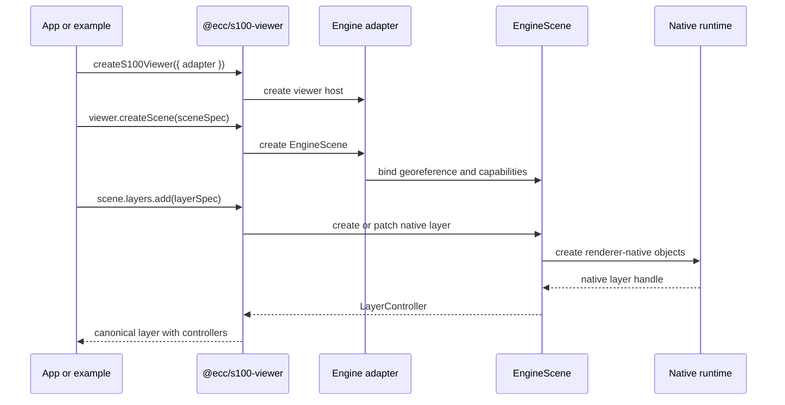

# Maintainability Refactor

Status: `ecc-lib-maintainability` branch, after phases 0 through 9.

This note explains the structural refactor performed on `ecc-s100-lib` to make
the library easier to maintain while preserving the current public package shape
used by S-100 Explorer and the example apps.

The refactor did not try to redesign the external API. The goal was to make the
inside of the library match the API direction already chosen: an engine-neutral
core package, renderer adapters, product sessions, typed controllers, and
examples that consume the same public package surfaces as applications.

## Why This Refactor Was Needed

The repository had grown quickly while the viewer API, NASA-AMMOS renderer,
Cesium renderer, S-111 workflow, parametric vessel model, and RTZ route support
were being developed together. That left several maintainability problems:

- Public adapter entry points were also implementation files.
- NASA-AMMOS runtime code lived under a `runtime/compat` path even after it had
  become maintained runtime code.
- Cesium adapter behavior was concentrated in one large source file.
- Engine-neutral product semantics were duplicated or implied inside adapters.
- Core package product features such as layer controllers, parametric vessel,
  RTZ parsing, route layout, and route sessions had become broad files.
- Examples had useful shared behavior, but some example-to-example imports made
  it less clear which code was package API and which code was demo scaffolding.

The current branch establishes clearer boundaries before the next round of
feature work.

## Current Package Model

The maintained package set is still:

- `@ecc/s100-viewer`
- `@ecc/s100-viewer-adapter-nasa-ammos`
- `@ecc/s100-viewer-adapter-cesium`

Applications and examples import the core package plus one or more adapters.
Adapters import the core package contracts, but the core package does not import
adapters.



The core package owns canonical viewer contracts, scene contracts, layer specs,
controllers, coordinates, depth semantics, product builders, product sessions,
and engine-neutral product behavior.

Adapter packages own native engine integration: renderer setup, layer
translation, native objects, picking, camera controls, lifecycle, materials,
shaders, image compatibility, and engine-specific cleanup.

## What Changed

### Guardrails Were Added First

The branch added local maintainability checks before moving major code:

- `npm run maintainability:check`
- `npm run file-size:check`
- `npm run boundaries:check`
- release-target helper scripts under `tools/`
- file-size allowlist metadata under `tools/file-size-allowlist.json`
- architecture notes under `docs/architecture`

The boundary check now protects the intended dependency direction:

- package source cannot import examples
- package source cannot import app code
- examples cannot import package `src` internals
- examples cannot import private package subpaths
- runnable examples cannot import each other, except shared helpers under
  `examples/shared`

### NASA-AMMOS Adapter Was Split

The NASA-AMMOS package root is now a small public barrel:

```text
packages/s100-viewer-adapter-nasa-ammos/src/index.ts
```

It exports only the adapter factory, capabilities, public options, and public
picking type. The implementation now lives behind feature-oriented folders:

```text
packages/s100-viewer-adapter-nasa-ammos/src/
  adapter/
  camera/
  coordinates/
  environment/
  layers/
  picking/
  runtime/
  shared/
```

The maintained runtime path was also renamed away from `runtime/compat`. The
runtime now makes the intended concepts visible:

```text
runtime/
  core/
  map/
  s111/
  scene/
  terrain/
```

The canonical adapter shell now depends on `NasaSceneRuntime`, not a
compatibility-named `ViewerScene` facade.

### Cesium Adapter Was Split Into A Public Shell And Feature Helpers

The Cesium package root is also a small public barrel:

```text
packages/s100-viewer-adapter-cesium/src/index.ts
```

The package now separates public adapter creation from implementation folders:

```text
packages/s100-viewer-adapter-cesium/src/
  adapter/
  camera/
  cesium/
  environment/
  layers/
```

This makes the public API surface easier to inspect and gives maintainers a
place to continue moving Cesium renderer internals out of
`adapter/CesiumEngineScene.ts` as follow-up work.

### Shared Product Semantics Were Extracted

Engine-neutral rendering rules were moved into core internal modules so adapters
do not need to each reinterpret the same product semantics.

```text
packages/s100-viewer/src/internal/
  adapter-utils/
    AbortableTask.ts
    DisposableStack.ts
    layerPatch.ts
    numeric.ts
    opacity.ts
    urlTemplate.ts
  products/
    depthStyle.ts
    encTransparency.ts
    routeStyle.ts
    s111Style.ts
    s111Time.ts
    vesselPose.ts
```

These modules are internal first-party helpers. They are not package-root API.
Their purpose is to keep adapters consistent on issues such as positive nautical
depth semantics, ENC transparency, S-111 time/style normalization, route style,
and CRS-aware vessel pose calculations.

### Core Product Hotspots Were Split

The core package now uses focused modules for areas that had become difficult
to navigate.

Layer controllers:

```text
packages/s100-viewer/src/layers/controllers/
  baseController.ts
  createLayerControllers.ts
  index.ts
  mapController.ts
  routeController.ts
  surfaceCurrentController.ts
  terrainController.ts
  types.ts
  vesselController.ts
```

Parametric vessel:

```text
packages/s100-viewer/src/products/parametric-vessel/
  bounds.ts
  defaults.ts
  geometry.ts
  index.ts
  layout.ts
  normalize.ts
  overrides.ts
  types.ts
  validation.ts
```

RTZ and route features:

```text
packages/s100-viewer/src/products/rtz-parser/
packages/s100-viewer/src/products/route-layout/
packages/s100-viewer/src/products/route-session/
```

Existing public import paths are preserved through barrels such as:

```text
packages/s100-viewer/src/products/rtz-parser.ts
packages/s100-viewer/src/products/route-layout.ts
packages/s100-viewer/src/products/route-session.ts
packages/s100-viewer/src/products/parametric-vessel.ts
packages/s100-viewer/src/layers/controllers.ts
```

### Example Boundaries Were Tightened

Shared example-only orchestration now lives in:

```text
examples/shared/featureSessions.ts
```

Runnable examples may import from `examples/shared`, but they should not import
each other's application entrypoints. Examples remain consumers of public
packages, not hidden package dependencies.

## Current Runtime Flow

The canonical runtime flow is now:



The important architectural point is that the app works through
`@ecc/s100-viewer` concepts: viewer, scene, layer specs, product sessions, and
controllers. Adapter-specific renderer objects stay behind adapter package
boundaries.

## Current State

Completed on the maintainability branch:

- Release-target package list is centralized.
- Package and example boundaries are checked locally.
- NASA-AMMOS root export is a small public barrel.
- NASA-AMMOS production runtime code is no longer imported from
  `runtime/compat`.
- Cesium root export is a small public barrel.
- Cesium has extracted adapter, camera, Cesium object, lifecycle, environment,
  and projected-WMS helper modules.
- Shared engine-neutral product semantics live in core internal modules.
- Core layer controllers, parametric vessel, RTZ parser, route layout, and
  route session modules have been split.
- Examples use package-level public imports and shared example-only helpers.
- Core product APIs now have public feature entrypoints such as
  `@ecc/s100-viewer/products/s111`, `@ecc/s100-viewer/products/route`, and
  `@ecc/s100-viewer/products/vessel`.
- Adapter package roots now avoid eager static imports of their viewer-host and
  large scene implementation modules. NASA-AMMOS layer helpers for S-102,
  S-111, ENC/map, vessel, and route rendering are loaded through cached dynamic
  imports when those layer families are used.
- `npm run bundle-shape:check` verifies important static import-graph
  assumptions for feature entrypoints and adapter eager paths.
- Local validation has covered release-target checks, demo checks, demo builds,
  and manual localhost startup for S-100 Explorer plus the main demos.

Known remaining maintainability debt:

- `packages/s100-viewer-adapter-nasa-ammos/src/runtime/scene/NasaSceneRuntime.ts`
  is still a large renderer-runtime file.
- `packages/s100-viewer-adapter-nasa-ammos/src/runtime/map/FlatMapOverlay.ts`
  still contains substantial map tile behavior.
- `packages/s100-viewer-adapter-nasa-ammos/src/runtime/s111/SeaCurrentsOverlay.ts`
  still contains substantial S-111 renderer behavior.
- `packages/s100-viewer-adapter-cesium/src/adapter/CesiumEngineScene.ts`
  is still the largest remaining adapter file. It is loaded lazily from the
  viewer host, but its internal layer families still need a deeper follow-up
  split.
- Some file-size allowlist entries can be reconciled after the split barrels
  and core product modules have stabilized.

## Future Phases Not Yet Implemented

### Phase 10: Package Release And Webapp Coordination

This phase should be done when the maintainability branch is ready to validate
against packaged artifacts rather than workspace source.

Recommended work:

- Bump package versions at a meaningful validation point.
- Run release-target checks:
  - `npm run check:release-target`
  - `npm run test:release-target`
  - `npm run build:release-target`
  - `npm run pack:release-target:dry-run`
- Produce release tarballs if the branch should be tested through URL imports.
- Update S-100 Explorer dependencies to the selected tarball URLs or local
  package references for the validation mode.
- Validate S-100 Explorer scenario behavior, including ENC, S-102,
  safety-depth styling, S-111 loading and playback, vessel controls, draught,
  heading, and any route features consumed by the app.
- Update the super-repo submodule pointer after each successful lib batch.

### Phase 11: CI And Release Hygiene

This phase should make the new guardrails durable in GitHub checks.

Recommended work:

- Add CI for the standalone lib repository.
- Run clean install, maintainability checks, release-target type checks,
  release-target tests, release-target builds, package dry-run, and key demo
  builds.
- Fail CI if `.env.local`, generated `dist`, tarballs, local planning files,
  demo-only secrets, or stale Cogs artifacts are accidentally packaged.
- Keep package readiness docs aligned with the scripts that CI runs.

### Follow-Up Renderer Splits

These can be done independently after the branch remains stable:

- Split `NasaSceneRuntime.ts` by camera navigation, terrain queues, custom
  models, picking hooks, vessel interaction, and render-loop coordination.
- Split `FlatMapOverlay.ts` by tile grid, tile loading, alpha handling,
  priority, and disposal.
- Split `SeaCurrentsOverlay.ts` by dataset loading, arrow geometry, materials,
  color bands, and time updates.
- Split `CesiumEngineScene.ts` by layer family: map imagery, S-102 tilesets,
  S-111 primitives, vessel entities, picking, and scene lifecycle.
- Split `s111-workflow.ts` only after S-111 orchestration settles further.

## Maintainer Rules Going Forward

- Keep package roots as public barrels.
- Keep app behavior out of package source.
- Keep examples as consumers, not dependencies.
- Put engine-neutral S-100 semantics in `@ecc/s100-viewer`.
- Put renderer-native behavior in the relevant adapter.
- Add or update boundary tests when a new package, example, or public subpath is
  introduced.
- Treat file-size allowlist entries as temporary explanations, not permanent
  permission to grow monoliths.

## Related Documents

- [Package boundaries](./package-boundaries.md)
- [Scene and layer lifecycle](./scene-layer-lifecycle.md)
- [Coordinates and depth](./coordinates-and-depth.md)
- [Adapter authoring guide](./adapter-authoring-guide.md)
- [Package readiness](../package-readiness.md)
