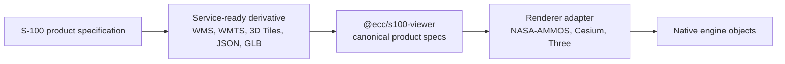

# S-100 Primer For Library Users

This page explains the S-100 vocabulary a developer needs before using
`ecc-s100-lib`. It is intentionally practical: the goal is to map standards
concepts to the library API, not to replace official IHO product specifications.

## The Core Idea

S-100 is a hydrographic data framework. It defines how maritime product
specifications describe features, metadata, coverage data, exchange sets,
portrayal, coordinate reference systems, and product-version identity.

`ecc-s100-lib` does not try to make browser applications parse every raw S-100
exchange-set format directly. Instead, it gives applications a stable viewer API
for service-ready data derived from S-100 products.



## Terms You Will See

| Term | Practical meaning in this library |
| --- | --- |
| Product specification | The S-100-family product type and version, such as an S-101 ENC or S-111 surface-current product. |
| Product type | The layer family in the core API: `S-101`, `S-102`, `S-104`, `S-111`, `S-57`, `vessel`, `route-plan`, and helper products. |
| Product specification version | A separate field from product type. Builders default it to `latest-confirmed-supported` unless the app supplies a concrete identifier. |
| Exchange set | A standard distribution package. Browser apps usually consume derived services/assets instead of raw exchange sets. |
| Source | The browser-consumable input for a layer, such as WMS, WMTS, 3D Tiles, static JSON, REST JSON, URL template, or GLB. |
| CRS | Coordinate reference system. Projected-local scenes use explicit projected metres, such as UTM. |
| Vertical datum | The vertical reference for elevation/depth. The library keeps depth sign handling centralized so apps do not duplicate conversions. |
| Portrayal | How data is shown visually. The app expresses intent through style/options; the adapter translates that to native renderer objects. |
| Time dynamic layer | A layer whose displayed state changes with `scene.time`, such as S-111 current vectors. |
| Adapter capability | A renderer's declared support for scene georeferences, products, data sources, picking, time, native handles, and visual features. |

## Product Families

| Family | What it represents | Typical source in this workspace |
| --- | --- | --- |
| S-101 | Electronic Navigational Chart data in the S-100 family. | WMS, WMTS, or WMS template ENC layers. |
| S-102 | Bathymetric surface data. | 3D Tiles terrain/bathymetry. |
| S-104 | Water-level data for surface navigation. | Generated S-104-shaped fixture JSON today; future real service/HDF5-derived JSON later. |
| S-111 | Surface current data with time metadata. | REST or static JSON current vectors. |
| S-57 | Legacy ENC data. It is supported for integration, but it is not itself an S-100 product specification. | WMS, WMTS, or WMS template ENC layers. |
| RTZ route | Route-plan input used for route portrayal workflows. The current route portrayal is S-421-like but exposed as an operational route feature. | RTZ XML files or URLs. |
| Vessel | Operational viewer feature, not an IHO product. | GLB/GLTF model or parametric vessel spec. |
| Live AIS | Operational feed workflow, not an IHO product. | Backend-proxy-normalized AIS-like vessel reports. |
| Simulated water level | Application helper data, not an IHO product. | Static or REST JSON time series. |

S-104 and simulated water level are deliberately separate. S-104 is a real IHO
product workflow with coordinate/time-aware sampling. Simulated water level is a
non-IHO helper for global scalar sea-level behavior.

## What The App Owns

Applications own workflow decisions:

- selecting the active adapter
- configuring service endpoints, proxies, credentials, and dataset ids
- choosing the scene CRS and origin
- mapping user controls into session calls
- handling loading, validation, status, and error UI
- deciding whether a product should use high-level sessions or low-level layer
  specs

## What The Library Owns

The core package owns the portable API:

- viewer and scene lifecycle
- canonical layer specs
- product builders and product sessions
- coordinate/depth helpers
- camera, time, picking, environment, and event APIs
- adapter capability contracts
- controller APIs for updating live layers

## What The Adapter Owns

Adapters own native rendering:

- creating the native viewer host and native scene
- translating canonical layer specs into engine-native objects
- loading renderer-specific assets and resources
- applying layer patches
- implementing picking or explaining that picking is unsupported
- disposing native objects when layers, scenes, or viewers are removed

## How To Read API Examples

When an example uses a feature session, the library is handling common
application mechanics:

```ts
const terrain = S102TerrainSession.create({ scene, crs, source });
await terrain.setDatasetIds(["NO_SAMPLE_S102"]);
```

When an example uses `LayerBuilder`, the application is closer to the canonical
layer kernel:

```ts
const layer = await scene.layers.add(LayerBuilder.createS102({
  url: "https://example.test/s102/tileset.json",
  crs: "EPSG:32619",
}));
```

Both paths end at the same adapter contract. Prefer sessions for application
screens and `LayerBuilder` for lower-level control or for implementing new
sessions.

## Common Mistakes

- Treating product type and product specification version as the same field.
- Importing adapter internals into app feature code.
- Assuming every adapter supports every recipe.
- Mixing geodetic coordinates into a projected-local scene without projection.
- Putting provider secrets into browser-delivered `.env.local` values when a
  backend proxy is required.
- Handling depth sign conversion separately in UI, session, and adapter code.

The quickest way to make these concepts concrete is to run the engine switcher
and watch the same recipe move through different adapter capabilities.
