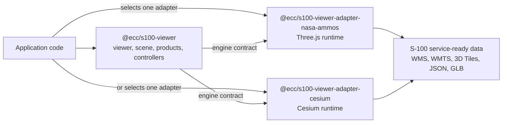
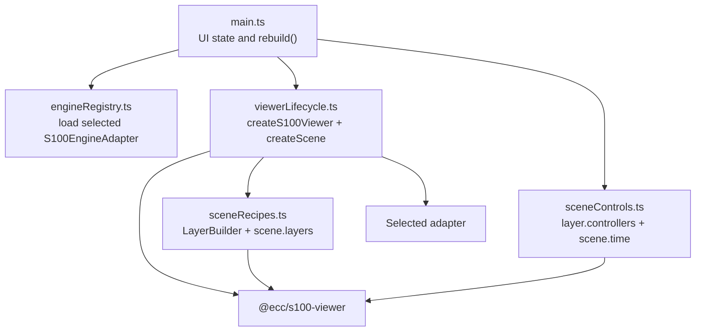
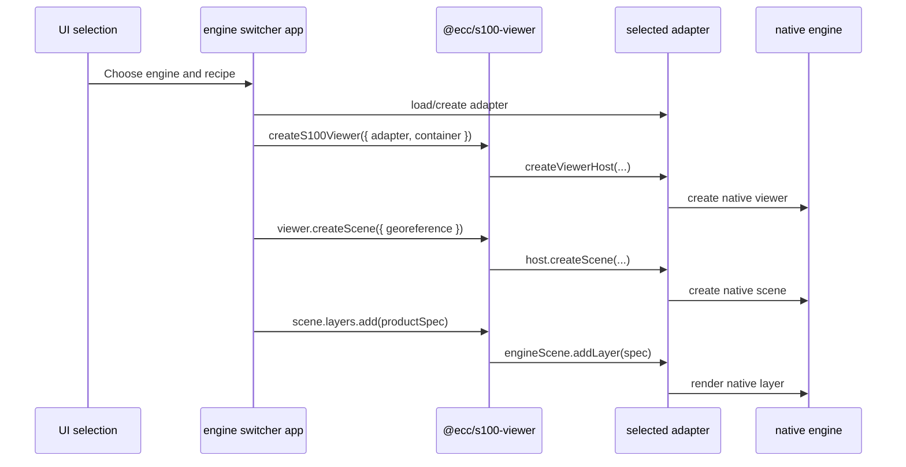
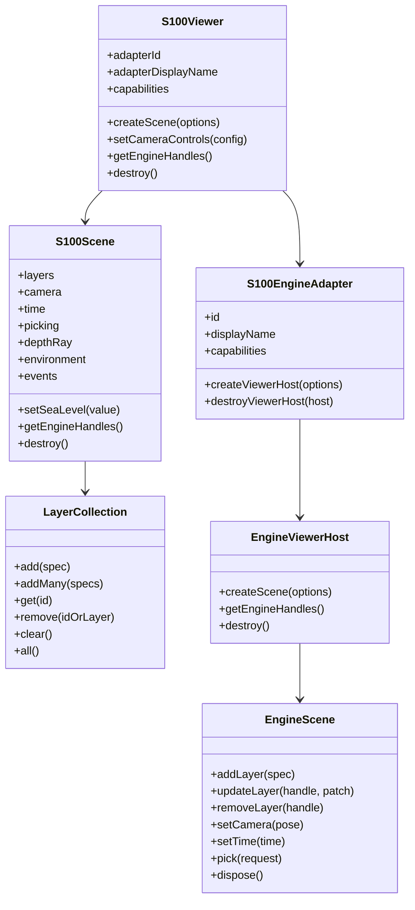
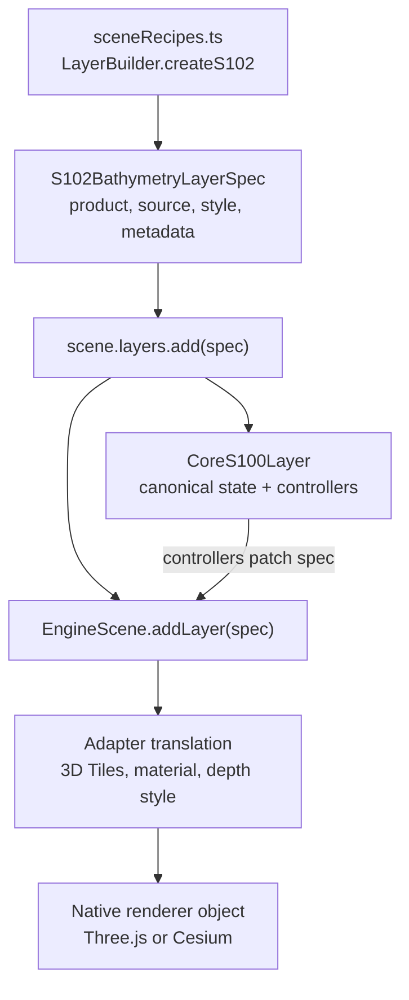

# Learn `ecc-s100-lib` With The Engine Adapter Switcher

This guide teaches `ecc-s100-lib` from zero knowledge of the library and zero
assumed knowledge of IHO S-100 standards. It uses the
`examples/engine-adapter-switcher` app as the practical path because that app
shows the intended package boundary: one product-first API, multiple rendering
engines.

## Guide Metadata

- `audience`: TypeScript developers who need to build with, evaluate, extend,
  or operate `@ecc/s100-viewer` and its adapter packages.
- `goal`: Learn the library from first run through API mastery, architecture
  reasoning, and first steps toward writing a new engine adapter.
- `prerequisites`: Node.js/npm, browser access, TypeScript familiarity, and
  local access to this workspace. Service-backed recipes also need local PRIMAR
  endpoint, licensee, API key, and dataset configuration.
- `component_versions`: `@ecc/s100-viewer@0.1.0-alpha.9`,
  `@ecc/s100-viewer-adapter-nasa-ammos@0.1.0-alpha.9`,
  `@ecc/s100-viewer-adapter-cesium@0.1.0-alpha.9`,
  `@ecc/s100-engine-adapter-switcher@0.0.0`.
- `commands`: `npm install`, `npm run check:demo:engine-switcher`,
  `npm run build:demo:engine-switcher`, `npm run demo:engine-switcher`.
- `expected_result`: A local Vite app at `http://localhost:<port>` where the
  same scene recipes can be loaded through NASA-AMMOS/Three.js and Cesium
  adapters.
- `failure_modes`: Missing `.env.local` values, service credentials, dataset
  ids, browser-origin restrictions, unsupported adapter capabilities, or
  renderer-specific asset setup.
- `known_limitations`: The current public package set is alpha. The Cogs adapter
  is not a release target. NASA-AMMOS is projected-local only. Cesium supports
  more globe-native concepts, but full curved-earth S-102/ENC replacement
  workflows are later-phase work.
- `next_steps`: After this guide, read `docs/api/README.md`, modify or add a
  switcher recipe, then prototype a minimal adapter with `createInMemoryAdapter`
  as the reference shape.
- `validation_evidence`: This guide is based on the current source files under
  `packages/s100-viewer`, `packages/s100-viewer-adapter-nasa-ammos`,
  `packages/s100-viewer-adapter-cesium`, and
  `examples/engine-adapter-switcher`. The referenced demo commands were
  validated with `npm run check:demo:engine-switcher` and
  `npm run build:demo:engine-switcher`.

## 1. The Short Mental Model

`ecc-s100-lib` is a TypeScript workspace for building S-100-capable maritime
viewer applications without tying application code to one renderer.

The core package is `@ecc/s100-viewer`. It owns:

- viewer and scene lifecycle
- S-100 product layer specifications
- coordinates and georeferencing
- camera, time, picking, environment, and event APIs
- product helpers such as `LayerBuilder`
- the `S100EngineAdapter` interface that renderers implement

Adapter packages own rendering:

- `@ecc/s100-viewer-adapter-nasa-ammos`: NASA-AMMOS/Three.js adapter
- `@ecc/s100-viewer-adapter-cesium`: Cesium adapter

Application code should mostly talk to `@ecc/s100-viewer`. The app should
import adapter packages only at a small engine-selection boundary.



The engine switcher example is the best first app because it keeps those
boundaries visible.

## 2. S-100 Concepts In Plain Language

IHO S-100 is a hydrographic data framework. In this library, you will mostly see
individual S-100 product types rather than the full standard machinery.

The current demo uses these product concepts:

- `S-101`: Electronic Navigational Chart data in the S-100 family. In the
  switcher it is rendered from WMS as an ENC basemap or overlay.
- `S-102`: Bathymetric surface data. In the switcher it is rendered from OGC 3D
  Tiles as terrain/depth.
- `S-111`: Surface current data. In the switcher it is fetched as JSON and
  rendered as time-aware current arrows.
- `S-57`: Legacy ENC data. The core package can represent S-57 ENC layers, but
  S-57 is not itself an S-100 product specification.
- `vessel`: An operational viewer feature, not an IHO S-100 product. It lets
  the app place and manipulate a vessel model in the same scene.
- `map-overlay` and `simulated-water-level`: Operational helper layers used by
  applications around S-100 data.

The library targets service-ready derivatives. It does not ask browser code to
parse raw S-100 exchange sets directly. Instead, the app points layers at
browser-consumable services and assets:

- WMS/WMTS/MVT for ENC and map layers
- 3D Tiles for S-102 bathymetry
- REST or static JSON for S-111 and simulated water levels
- GLB/GLTF for vessel models

The product type and product specification version are separate fields. Builders
default S-100 product layers to:

```ts
productSpecificationVersion: "latest-confirmed-supported"
```

Pass a concrete identifier, such as `INT.IHO.S-111.1.0`, only when the service
metadata exposes it and the implementation has validated that edition.

## 3. Run The Engine Switcher

From the workspace root of `libs/ecc-s100-lib`:

```sh
npm install
cp examples/engine-adapter-switcher/.env.example examples/engine-adapter-switcher/.env.local
npm run check:demo:engine-switcher
npm run build:demo:engine-switcher
npm run demo:engine-switcher
```

Open the local Vite URL shown by the command, usually
`http://localhost:<port>`.

The `.env.local` file controls the service-backed datasets:

```sh
VITE_S111_PRIMAR_API_KEY=
VITE_DEMO_LICENSEE_KEY=
VITE_S102_PRIMAR_3D_TILES_ENDPOINT=https://example.invalid/3dtiles_apikey/
VITE_S111_PRIMAR_ENDPOINT=https://example.invalid/api/rest/s100-json-web-service/s111/
VITE_PRIMAR_WMS_URL_BASE=https://example.invalid/wms_ip/anonymous
VITE_DEMO_S102_DATASET_IDS=
VITE_DEMO_S111_DATASET_IDS=
VITE_DEMO_CRS=EPSG:32619
VITE_DEMO_ORIGIN_X=0
VITE_DEMO_ORIGIN_Y=0
VITE_DEMO_ORIGIN_Z=0
VITE_DEMO_MAP_WIDTH_METERS=5000
```

If these values are empty, use the app as a code-reading exercise first. The
service-backed recipes will report missing configuration until real endpoint,
license, key, and dataset values are supplied.

## 4. First Tour Of The App

Open these files in order:

1. `examples/engine-adapter-switcher/src/main.ts`
2. `examples/engine-adapter-switcher/src/engineRegistry.ts`
3. `examples/engine-adapter-switcher/src/viewerLifecycle.ts`
4. `examples/engine-adapter-switcher/src/sceneRecipes.ts`
5. `examples/engine-adapter-switcher/src/sceneControls.ts`

They map to the application architecture:

- `main.ts`: DOM wiring, selected engine, selected recipe, rebuild flow
- `engineRegistry.ts`: the only place that imports adapter packages
- `viewerLifecycle.ts`: creates and destroys the canonical `S100Viewer` and
  `S100Scene`
- `sceneRecipes.ts`: adds S-101, S-102, S-111, and vessel layers through the
  product API
- `sceneControls.ts`: changes already-added layers through canonical
  controllers



Read the app as a layered tutorial:

1. Pick an engine.
2. Create a viewer with that engine.
3. Create a projected/local scene.
4. Add product layers.
5. Control those layers without touching engine-native objects.
6. Destroy everything cleanly when the engine or recipe changes.

## 5. The Minimal Viewer Lifecycle

The core lifecycle is in `viewerLifecycle.ts`.

```ts
const adapter = await options.engine.load(logger);

const viewer = await createS100Viewer({
  container: options.container,
  adapter,
  logger,
  cameraControls: CameraControlPresets.S100_DEFAULT,
  metadata: {
    app: "@ecc/s100-engine-adapter-switcher",
    recipe: options.recipe.id,
  },
});

const scene = await viewer.createScene({
  georeference: SceneBuilder.projectedLocal({
    crs: sceneSettings.crs,
    origin: sceneSettings.origin,
  }),
  metadata: {
    recipe: options.recipe.id,
  },
});
```

What this teaches:

- `createS100Viewer(...)` is the normal entry point.
- The app passes an `S100EngineAdapter`; the core package validates the adapter
  capabilities before creating the engine host.
- A viewer can create scenes.
- A scene has a georeference. Today, the common release-target mode is
  `projected-local`.
- The app can attach metadata, but product behavior is still driven by typed
  layer specs and controllers.

The lifecycle diagram:



Clean teardown matters because each adapter owns real renderer resources:

```ts
await destroyViewerSession(previousSession);
viewerElement.replaceChildren();
```

And the session itself destroys the viewer:

```ts
async destroy() {
  for (const unsubscribe of unsubscribers) {
    unsubscribe();
  }
  await viewer.destroy();
}
```

`viewer.destroy()` destroys scenes first, then the adapter viewer host.

## 6. How Engine Switching Works

The switcher uses an app-local engine registry.

```ts
export type DemoEngineId = "nasa-ammos" | "cesium";

export type DemoEngineDefinition = {
  id: DemoEngineId;
  label: string;
  description: string;
  load(logger?: LoggerLike): Promise<S100EngineAdapter>;
};
```

NASA-AMMOS is imported normally:

```ts
import { createNasaAmmosAdapter } from "@ecc/s100-viewer-adapter-nasa-ammos";
```

Cesium is loaded dynamically with its runtime:

```ts
const [{ createCesiumAdapter }, cesiumModule] = await Promise.all([
  import("@ecc/s100-viewer-adapter-cesium"),
  import("cesium"),
]);

return createCesiumAdapter({
  cesiumModule,
  dynamicLighting: true,
  viewerOptions: {
    animation: false,
    baseLayerPicker: false,
    geocoder: false,
    homeButton: false,
    navigationHelpButton: false,
    sceneModePicker: false,
    timeline: false,
  },
  fetchHandler: window.fetch.bind(window),
});
```

This is the main integration rule:

Application feature code should not know which engine is active. Only the
engine registry knows that.

## 7. How Recipe Support Is Checked

Every adapter publishes capabilities:

```ts
type AdapterCapabilities = {
  sceneGeoreferences: readonly SceneGeoreferenceMode[];
  layerProducts: readonly string[];
  supportedProductVersions?: readonly S100ProductVersionSupport[];
  dataSources: readonly string[];
  cameraControls: readonly ("pose" | "look-at")[];
  picking: boolean;
  timeDynamicLayers: boolean;
  nativeHandles: boolean;
  precisionStrategy?: AdapterPrecisionStrategy;
  globe?: {
    ellipsoidEcef: boolean;
    globeNative3dTiles?: boolean;
    oceanMasking?: boolean;
  };
  visualFeatures?: AdapterVisualCapabilities;
  extensions?: Record<string, unknown>;
};
```

The switcher recipes describe what they need:

```ts
export type DemoSceneRecipe = {
  id: DemoRecipeId;
  label: string;
  description: string;
  requiredProducts?: readonly string[];
  requiredDataSources?: readonly string[];
  requiredVisualFeatures?: readonly (keyof NonNullable<AdapterCapabilities["visualFeatures"]>)[];
  apply(scene: S100Scene, context: DemoSceneRecipeContext): Promise<void>;
};
```

Then `assessRecipeSupport(...)` compares recipe needs to adapter capabilities:

```ts
for (const product of recipe.requiredProducts ?? []) {
  if (!capabilities.layerProducts.includes(product)) {
    reasons.push(`Missing layer product: ${product}`);
  }
}
```

That check is the first line of defense. It prevents a recipe from starting if
the selected adapter cannot render the needed product, data source, or visual
feature.

## 8. Scene Georeferencing Without GIS Background

A renderer needs to know where local scene coordinates sit in the real world.
The current common path is `projected-local`:

```ts
const scene = await viewer.createScene({
  georeference: SceneBuilder.projectedLocal({
    crs: "EPSG:32619",
    origin: { x: 331100, y: 5186420, z: 0 },
  }),
});
```

Read this as:

- `crs`: the coordinate reference system used by projected data
- `origin`: the local scene origin expressed in that CRS
- `units`: meters, set by the builder
- `upAxis`: z-up, set by the builder

The engine switcher reads these values from `.env.local`:

```ts
export const getDemoSceneSettings = (): DemoSceneSettings => ({
  crs: readEnv("VITE_DEMO_CRS") ?? "EPSG:32619",
  origin: {
    x: readNumberEnv("VITE_DEMO_ORIGIN_X", 331100),
    y: readNumberEnv("VITE_DEMO_ORIGIN_Y", 5186420),
    z: readNumberEnv("VITE_DEMO_ORIGIN_Z", 0),
  },
  mapWidthMeters: readNumberEnv("VITE_DEMO_MAP_WIDTH_METERS", 5000),
});
```

Mastery checkpoint:

- Use `SceneBuilder.projectedLocal(...)` for the current release-target path.
- Keep CRS and origin explicit.
- Do not assume WGS84 longitude/latitude unless the layer or scene explicitly
  uses geodetic coordinates.
- Treat ellipsoid/ECEF as adapter-capability-dependent and still evolving.

## 9. Add The First Product Layer: S-101 ENC

The minimal recipe creates a projected-local scene and adds an S-101 ENC WMS
basemap:

```ts
await scene.layers.add(createS101BasemapLayer());
```

The layer itself is built through `LayerBuilder`:

```ts
return LayerBuilder.createS101WmsTemplate({
  id: "demo-s101-basemap",
  title: "S-101 ENC basemap",
  urlTemplate,
  layers: config.s101WmsLayers,
  role: "basemap",
  ...projectedMap,
  style: {
    visible: true,
    opacity: 1,
    cutout: {
      enabled: false,
    },
  },
  metadata: {
    description: "Service-backed S-101 WMS basemap for the current projected-local scene.",
  },
});
```

Important ideas:

- The layer spec is product-first: `S-101`, `ENC`, `WMS template`.
- The same layer spec goes through either adapter.
- `role: "basemap"` tells the app and adapter how to treat this ENC layer.
- `projectedMap` describes the projected WMS footprint and tile behavior.
- The adapter translates the canonical spec into renderer-native imagery.

The WMS URL template is built without hardcoding adapter behavior:

```ts
LayerBuilder.buildWmsUrlTemplate({
  baseUrl: config.s101WmsBaseUrl,
  parameters: [
    ["bbox", "{xmin},{ymin},{xmax},{ymax}"],
    ["FORMAT", "image/png"],
    ["SERVICE", "WMS"],
    ["VERSION", "1.1.1"],
    ["SRS", config.crs],
    ["REQUEST", "GetMap"],
    ["LAYERS", config.s101WmsLayers.join(",")],
  ],
});
```

Practice task:

1. Open `sceneRecipes.ts`.
2. Change the S-101 basemap `opacity` from `1` to `0.8`.
3. Run `npm run check:demo:engine-switcher`.
4. Run the demo and reload the Minimal Scene.

What you learned: layer style belongs in the layer spec, not in NASA-AMMOS or
Cesium code.

## 10. Add S-102 Bathymetry Terrain

The S-102 recipe adds an S-101 overlay first, then a 3D Tiles terrain layer:

```ts
const terrain = await scene.layers.add(
  LayerBuilder.createS102({
    id: datasetLabel,
    title: "Demo S-102 bathymetry",
    url: buildS102TilesUrl(config),
    crs: config.crs,
    query: { crs: config.crs },
    rendering: {
      detailFactor: 500,
    },
    style: {
      safetyDepthMeters: 8,
      shading: "hypsometric",
    },
    metadata: {
      datasetId: datasetLabel,
      description: "Service-backed S-102 3D Tiles dataset.",
    },
  }),
);

await terrain.controllers.terrain.setContours({
  visible: true,
  intervalMeters: 5,
});
```

Key S-102 concepts:

- S-102 is bathymetry/depth-oriented.
- The browser-facing source is `3d-tiles`.
- `safetyDepthMeters` follows nautical chart convention: positive depth
  downward from the active water surface or sea level.
- Adapters convert that product meaning to their own z-up/elevation model.
- Terrain controls live at `terrain.controllers.terrain`.

The controller is how runtime UI changes should work:

```ts
await terrain.controllers.terrain.setSafetyDepthMeters(8);
await terrain.controllers.terrain.setTileBoundsVisible(true);
await terrain.controllers.terrain.setContours({ visible: true, intervalMeters: 5 });
```

Practice task:

1. Open the S-102 recipe in `sceneRecipes.ts`.
2. Change `safetyDepthMeters` to `12`.
3. Change the contour interval to `2`.
4. Run typecheck and the demo.

What you learned: initial style is part of the spec; interactive changes go
through controllers.

## 11. Add S-111 Surface Currents And Time

The S-111 recipe uses a workflow helper because real current datasets need
fetching, normalization, time metadata, and scene time setup:

```ts
const workflowResult = await S111Workflow.prepare({
  datasets: config.s111DatasetIds.map((datasetId) => ({
    id: datasetId,
    title: `S-111 ${datasetId}`,
    bounds: {
      projected: demoProjectedBounds(config),
    },
  })),
  crs: config.crs,
  service: createPrimarS111Service({
    endpoint: s111Endpoint,
    licenseeKey,
  }),
  limits: {
    dataFetchConcurrency: 2,
  },
  time: {
    interpolation: "nearest",
  },
  style: {
    renderer: "arrows",
    scale: "auto",
  },
});

await S111Workflow.addPreparedLayers(scene, workflowResult.prepared);
S111Workflow.configureSceneTime(scene, workflowResult.timeline, {
  play: true,
  loop: true,
  rate: 10,
});
```

Key S-111 concepts:

- S-111 surface currents are time-aware.
- `scene.time` is the canonical clock.
- S-111 layer controllers can set the visible current time.
- The adapter renders the current vectors; the app does not draw arrows itself.

The scene controls demonstrate the time API:

```ts
const availability = scene.time.getAvailability();
const playbackState = scene.time.getPlaybackState();

scene.time.setCurrent(new Date(nextTime));
scene.time.play({
  loop: true,
  rate: 10,
  stepMs,
});
scene.time.pause();
```

Practice task:

1. Open `sceneControls.ts`.
2. Find `createS111TimeControl`.
3. Change `defaultS111PlaybackRate` from `10` to `5`.
4. Run `npm run check:demo:engine-switcher`.

What you learned: scene time is shared scene state, not an adapter-specific
timeline widget.

## 12. Add A Vessel Layer

The vessel recipe adds a GLB model with operational vessel semantics:

```ts
const vessel = await scene.layers.add(
  LayerBuilder.createVessel({
    id: "demo-vessel",
    title: "Demo vessel",
    url: demoVesselModelUrl,
    format: "glb",
    crs: getDemoLookAtTarget().crs,
    pose: {
      position: getDemoLookAtTarget(),
      headingDegrees: 35,
    },
    dimensions: demoVesselDimensions,
    referencePoint: "transponder",
    style: {
      draughtMeters: demoVesselDimensions.draught,
      showSeaLevelIndicator: true,
      transformControls: "translate-rotate",
    },
  }),
);

await vessel.controllers.vessel.setTransformMode("translate-rotate");
```

Key vessel concepts:

- Vessel is an operational layer, not an IHO S-100 product.
- The layer still uses the same `scene.layers.add(...)` path.
- Vessel dimensions are semantic: `bow`, `stern`, `port`, `starboard`,
  `draught`.
- The transform gizmo is capability-gated because not every adapter must support
  every visual feature.

Practice task:

1. Change the vessel heading from `35` to `90`.
2. Run the switcher and compare NASA-AMMOS and Cesium.
3. Check the capability panel if a visual feature is unsupported.

What you learned: operational viewer features use the same API shape as S-100
product layers.

## 13. The Layer API Mastery Map

Every layer starts as a spec:

```ts
const spec = LayerBuilder.createS102({
  id: "bathymetry",
  url: "https://example.test/s102/tileset.json",
  crs: "EPSG:32619",
});
```

Then it becomes a live `S100Layer`:

```ts
const layer = await scene.layers.add(spec);
```

The live layer gives you:

```ts
layer.id;
layer.product;
layer.spec;
layer.visible;
layer.opacity;
layer.controllers;

await layer.update({ opacity: 0.5 });
await layer.remove();
const native = layer.getNativeHandle();
```

The collection gives you:

```ts
scene.layers.size;
scene.layers.get("bathymetry");
scene.layers.has("bathymetry");
scene.layers.all();
await scene.layers.remove("bathymetry");
await scene.layers.clear();
```

Use typed controllers when available:

```ts
if (layer.controllers.terrain) {
  await layer.controllers.terrain.setSafetyDepthMeters(8);
}

if (layer.controllers.map) {
  await layer.controllers.map.setAlpha(0.6);
}

if (layer.controllers.surfaceCurrent) {
  layer.controllers.surfaceCurrent.setCurrentTime(Date.now());
}

if (layer.controllers.vessel) {
  await layer.controllers.vessel.setHeading(45);
}
```

Mastery checkpoint:

- Specs describe desired product state.
- `scene.layers.add(...)` hands specs to the adapter and returns a live layer.
- `layer.update(...)` patches canonical state and asks the adapter to update.
- Controllers are convenience APIs over canonical layer patches.
- Native handles are escape hatches, not the normal path.

## 14. Scene API Mastery Map

An `S100Scene` exposes the main runtime subsystems:

```ts
scene.layers;
scene.camera;
scene.time;
scene.picking;
scene.depthRay;
scene.environment;
scene.events;
scene.georeference;
scene.adapterCapabilities;
```

Camera:

```ts
scene.camera.lookAt({
  target: {
    kind: "projected",
    crs: "EPSG:32619",
    x: 331100,
    y: 5186420,
    z: 0,
  },
  rangeMeters: 900,
  headingDegrees: 25,
  pitchDegrees: 62,
});

const pose = scene.camera.getPose();
const unsubscribe = scene.camera.onChanged((nextPose) => {
  console.log(nextPose);
});
unsubscribe();
```

Picking:

```ts
const pick = await scene.picking.pick({
  screenX: event.clientX,
  screenY: event.clientY,
  fallback: "sea-level-plane",
});

if (pick?.world) {
  console.log(pick.product, pick.layerId, pick.depthMeters, pick.world);
}
```

Environment:

```ts
scene.environment.setState({
  background: "skybox",
  lighting: {
    ambientIntensity: 0.2,
    directionalIntensity: 0.8,
  },
});
```

Events:

```ts
const unsubscribe = scene.events.on("layer.added", (layer) => {
  console.log(`Layer added: ${layer.id}`);
});
```

Sea level:

```ts
scene.setSeaLevel(1.2);
const seaLevel = scene.getSeaLevel();
```

Native handles:

```ts
const handles = scene.getEngineHandles();
console.log(handles.adapterId, handles.engineName);
```

Use `getEngineHandles()` only for advanced integration. Treat returned objects
as borrowed references that become invalid after `scene.destroy()`.

## 15. Viewer API Mastery Map

The viewer owns the adapter host and scene lifecycle:

```ts
const viewer = await createS100Viewer({
  container,
  adapter,
  logger,
  cameraControls: CameraControlPresets.S100_DEFAULT,
});
```

Important viewer fields and methods:

```ts
viewer.adapterId;
viewer.adapterDisplayName;
viewer.capabilities;
viewer.getCapabilities();
viewer.getCameraControls();
viewer.setCameraControls(CameraControlPresets.DISABLED);
viewer.getEngineHandles();

const scene = await viewer.createScene({ georeference });
await viewer.destroy();
```

Use one viewer per active native viewer host. The switcher destroys and
recreates the viewer when the selected engine changes because the underlying
renderer is different.

## 16. Product Builder Cheat Sheet

Import from the core package:

```ts
import { LayerBuilder } from "@ecc/s100-viewer";
```

S-101 ENC:

```ts
const s101 = LayerBuilder.createS101Wms({
  id: "s101-overlay",
  url: "https://example.test/wms",
  layers: ["s100dataSets.101"],
  crs: "EPSG:32619",
  role: "overlay",
});
```

S-101 WMS template for projected/local tiled map workflows:

```ts
const geometry = LayerBuilder.ProjectedMap.fromCenterExtent({
  center: { x: 331100, y: 5186420, crs: "EPSG:32619" },
  widthMeters: 5000,
  crs: "EPSG:32619",
  minLevel: 3,
  maxLevel: 5,
  discardMode: LayerBuilder.ProjectedMapDiscardMode.None,
});

const s101Template = LayerBuilder.createS101WmsTemplate({
  id: "s101-template",
  urlTemplate: "https://example.test/wms?bbox={xmin},{ymin},{xmax},{ymax}",
  layers: ["s100dataSets.101"],
  role: "basemap",
  ...geometry,
});
```

S-57 ENC:

```ts
const s57 = LayerBuilder.createS57Wms({
  id: "legacy-enc",
  url: "https://example.test/wms",
  layers: ["enc_cells"],
  role: "overlay",
});
```

S-102 bathymetry:

```ts
const s102 = LayerBuilder.createS102({
  id: "s102-bathymetry",
  url: "https://example.test/s102/tileset.json",
  crs: "EPSG:32619",
  style: {
    safetyDepthMeters: 8,
    shading: "hypsometric",
  },
});
```

S-111 surface currents from REST:

```ts
const s111 = LayerBuilder.createS111({
  id: "surface-currents",
  url: "https://example.test/s111/currents.json",
  crs: "EPSG:32619",
  time: {
    interpolation: "nearest",
  },
  style: {
    renderer: "arrows",
    scale: "auto",
  },
});
```

Static S-111:

```ts
const prepared = LayerBuilder.prepareStaticS111({
  id: "static-currents",
  data: surfaceCurrentData,
  crs: "EPSG:32619",
});

await scene.layers.add(prepared.layer);
```

Vessel:

```ts
const vessel = LayerBuilder.createVessel({
  id: "vessel",
  url: "/demo-assets/vessel/panama-tanker-origin-at-transponder.glb",
  format: "glb",
  crs: "EPSG:32619",
  pose: {
    position: { kind: "projected", crs: "EPSG:32619", x: 331100, y: 5186420, z: 0 },
    headingDegrees: 35,
  },
  dimensions: {
    draught: 12,
    bow: 195.2,
    stern: 30,
    port: 20.8,
    starboard: 11.2,
  },
  referencePoint: "transponder",
});
```

ENC transparent/opaque pair:

```ts
const encPair = LayerBuilder.createEncWmsPair({
  standard: LayerBuilder.EncStandard.S101,
  center: { x: 331100, y: 5186420, crs: "EPSG:32619" },
  widthMeters: 5000,
  crs: "EPSG:32619",
  minLevel: 3,
  maxLevel: 5,
  transparent: {
    id: "s101-overlay",
    urlTemplate,
    layers: ["s100dataSets.101"],
    role: "overlay",
  },
  opaque: {
    id: "s101-basemap",
    urlTemplate,
    layers: ["s100dataSets.101"],
    role: "basemap",
  },
});

await scene.layers.addMany([encPair.opaque, encPair.transparent].filter(Boolean));
```

## 17. Public API Inventory

The package root `@ecc/s100-viewer` re-exports the public developer surface.
Use this inventory as a mastery checklist and then inspect
`packages/s100-viewer/src/index.ts` for the exact current export list.

| Area | Main exports | What to use them for |
| --- | --- | --- |
| Viewer | `createS100Viewer`, `S100Viewer`, `CreateS100ViewerOptions` | Create adapter-backed viewers, scenes, and viewer-level camera controls. |
| Adapters | `S100EngineAdapter`, `AdapterCapabilities`, `EngineViewerHost`, `EngineScene`, `EngineLayerHandle`, `EngineHandleBundle`, `createInMemoryAdapter` | Select an adapter, inspect capabilities, or implement a new renderer boundary. |
| Scene | `S100Scene`, `SceneOptions`, `EnvironmentController`, `EnvironmentState` | Work with layers, camera, time, picking, environment, sea level, and scene events. |
| Coordinates | `SceneBuilder`, `Coordinates`, `Coordinate`, `ProjectedCoordinate`, `GeodeticCoordinate`, `EcefCoordinate`, `SceneGeoreference` | Describe where scene and product data live in the real world. |
| Camera | `CameraControlPresets`, `CameraController`, `CameraLookAt`, `EngineCameraPose`, `CameraControlConfig` | Set camera controls, move the camera, and listen for pose changes. |
| Layers | `LayerCollection`, `S100Layer`, `LayerSpec`, `LayerPatch`, `S100ProductType` | Add, update, remove, and inspect live product layers. |
| Controllers | `TerrainLayerController`, `MapLayerController`, `SurfaceCurrentLayerController`, `VesselLayerController` | Make product-specific runtime changes without native engine code. |
| Products | `LayerBuilder`, `defineS100LayerSpec`, `S100SupportedProductVersions`, product spec types | Build S-101, S-57, S-102, S-111, simulated water-level, vessel, and map overlay specs. |
| Time | `TimeController`, `TimeInterval`, `TimePlaybackOptions`, `TimePlaybackState` | Drive time-aware products such as S-111. |
| Picking | `PickingController`, `DepthRayController`, `PickRequest`, `PickResult`, `LivePickingOptions` | Query scene content under screen coordinates and configure live picking visuals. |
| Events | `EventBus`, `S100EventBus`, `S100Unsubscribe` | Subscribe to scene/layer/time/camera/error changes. |
| Math | `createBoundingBox`, `createQuatIdentity`, `createVec2`, `createVec3`, vector tuple types | Provide small geometry values for product specs, especially vessels and tools. |
| Errors | `S100Error`, `S100ErrorCode` | Surface normalized viewer, scene, layer, adapter, and validation errors. |

Master the API by category:

1. Build a scene with `createS100Viewer` and `SceneBuilder`.
2. Add each major product type with `LayerBuilder`.
3. Update each product through its controller.
4. Subscribe to scene events and camera/time changes.
5. Use picking and depth-ray APIs.
6. Inspect adapter capabilities and native handles.
7. Implement or modify an adapter method.

## 18. Architecture: Core, Adapter, Engine

The core package wraps adapter implementations with stable application-facing
objects:



The separation is deliberate:

- Apps own product intent.
- Core owns portable lifecycle and contracts.
- Adapters own native rendering details.
- Engines own pixels, primitives, entities, textures, and renderer resources.

## 19. Data Flow From Recipe To Renderer

When the S-102 recipe adds terrain, the data flow looks like this:



The app never has to construct a Three.js mesh or Cesium entity for S-102.
That is the adapter's job.

## 20. Add Your Own Recipe

Create a small recipe before writing a new adapter. It is the fastest way to
learn the API.

1. Add a new id to `DemoRecipeId`.
2. Add a recipe entry in `sceneRecipes`.
3. Declare `requiredProducts` and `requiredDataSources`.
4. Implement `apply(scene, context)`.
5. Add one or more layers with `LayerBuilder`.
6. Run `npm run check:demo:engine-switcher`.
7. Run the demo and switch engines.

Example conceptual recipe:

```ts
export type DemoRecipeId =
  | "minimal"
  | "s101-enc"
  | "s102-terrain"
  | "s111-time"
  | "vessel"
  | "my-s102-debug";

sceneRecipes["my-s102-debug"] = {
  id: "my-s102-debug",
  label: "My S-102 Debug",
  description: "Loads S-102 terrain with tile bounds visible.",
  requiredProducts: ["S-102"],
  requiredDataSources: ["3d-tiles"],
  async apply(scene) {
    const terrain = await scene.layers.add(
      LayerBuilder.createS102({
        id: "debug-terrain",
        url: "https://example.test/s102/tileset.json",
        crs: scene.crs ?? "EPSG:32619",
        debug: { showTileBounds: true },
      }),
    );

    await terrain.controllers.terrain.setTileBoundsVisible(true);
  },
};
```

Use this to test whether your mental model is right:

- Does the recipe fail before rendering if capabilities are missing?
- Does the same spec work on both adapters?
- Did you avoid engine-native imports in the recipe?
- Can controls update the layer through controllers?

## 21. Build A Minimal Engine Adapter

Adapter authoring starts with `S100EngineAdapter`:

```ts
import {
  S100SupportedProductVersions,
  type EngineLayerHandle,
  type EngineScene,
  type EngineViewerHost,
  type S100EngineAdapter,
} from "@ecc/s100-viewer";

export const createMyEngineAdapter = (): S100EngineAdapter => ({
  id: "my-engine",
  displayName: "My Engine",
  capabilities: {
    sceneGeoreferences: ["projected-local"],
    layerProducts: ["S-101", "S-102"],
    supportedProductVersions: S100SupportedProductVersions.filter((support) =>
      ["S-101", "S-102"].includes(support.product),
    ),
    dataSources: ["wms", "wms-template", "3d-tiles"],
    cameraControls: ["pose", "look-at"],
    picking: false,
    timeDynamicLayers: false,
    nativeHandles: true,
    precisionStrategy: "engine-native",
  },
  async createViewerHost(options): Promise<EngineViewerHost> {
    const engineViewer = createNativeViewer(options.container);

    return {
      getEngineHandles() {
        return {
          adapterId: "my-engine",
          engineName: "My Engine",
          engineInstance: engineViewer,
        };
      },
      async createScene(sceneOptions): Promise<EngineScene> {
        const engineScene = engineViewer.createScene(sceneOptions);
        const layers = new Map<EngineLayerHandle, unknown>();

        return {
          setCamera(pose) {
            engineScene.setCameraPose(pose);
          },
          getCamera() {
            return engineScene.getCameraPose();
          },
          lookAt(view) {
            engineScene.lookAt(view.target, view.rangeMeters);
          },
          setTime(time) {
            engineScene.setTime(time);
          },
          setSeaLevel(value) {
            engineScene.setSeaLevel(value);
          },
          async addLayer(spec) {
            const nativeLayer = await engineScene.addProductLayer(spec);
            const handle = { id: spec.id, native: nativeLayer };
            layers.set(handle, nativeLayer);
            return handle;
          },
          async updateLayer(handle, patch) {
            await engineScene.updateProductLayer(handle.native, patch);
          },
          async removeLayer(handle) {
            await engineScene.removeProductLayer(handle.native);
            layers.delete(handle);
          },
          async pick() {
            return null;
          },
          dispose() {
            for (const handle of layers.keys()) {
              void engineScene.removeProductLayer(handle.native);
            }
            layers.clear();
            engineScene.destroy();
          },
        };
      },
      destroy() {
        engineViewer.destroy();
      },
    };
  },
});
```

The names `createNativeViewer`, `engineViewer`, and `engineScene` are
placeholders for your renderer. The important contract is real:

- `createViewerHost(...)` creates the native viewer host.
- `createScene(...)` creates an adapter scene for the core scene.
- `addLayer(...)` translates canonical layer specs to native renderer objects.
- `updateLayer(...)` applies canonical patches.
- `removeLayer(...)` disposes native layer resources.
- `dispose()` releases scene resources.
- `destroy()` releases viewer resources.

For a fully working minimal reference, read
`packages/s100-viewer/src/adapters/InMemoryAdapter.ts`. It stores layers in a
map, supports camera/time/picking hooks, and avoids renderer complexity.

## 22. Adapter Implementation Checklist

Before an adapter is useful in the engine switcher, answer these questions:

- Which `sceneGeoreferences` can the engine really support?
- Which `layerProducts` can it render now?
- Which `dataSources` can it consume now?
- Does it support time-dynamic layers?
- Does it support picking?
- Which visual features are real and which are unsupported?
- Are native handles exposed with predictable keys?
- Does every native object get cleaned up on layer removal and scene disposal?
- Are service errors surfaced as useful errors?
- Can it run without application code importing engine internals?

Suggested first capability set:

```ts
capabilities: {
  sceneGeoreferences: ["projected-local"],
  layerProducts: ["S-101"],
  supportedProductVersions: S100SupportedProductVersions.filter(
    (support) => support.product === "S-101",
  ),
  dataSources: ["wms", "wms-template"],
  cameraControls: ["pose", "look-at"],
  picking: false,
  timeDynamicLayers: false,
  nativeHandles: true,
  precisionStrategy: "engine-native",
}
```

Then add features in this order:

1. Viewer and scene lifecycle
2. Camera pose and look-at
3. S-101 WMS imagery
4. Layer update/remove
5. S-102 3D Tiles
6. Picking
7. S-111 time
8. Vessel/model support
9. Environment/lighting
10. Native handles and diagnostics

## 23. Plug A New Adapter Into The Switcher

After you have a `createMyEngineAdapter()` function:

1. Add the adapter package dependency to the switcher workspace.
2. Extend `DemoEngineId`.
3. Add an entry in `engineDefinitions`.
4. Run typecheck.
5. Start with the Minimal Scene recipe.

Example:

```ts
export type DemoEngineId = "nasa-ammos" | "cesium" | "my-engine";

export const engineDefinitions = {
  // existing entries...
  "my-engine": {
    id: "my-engine",
    label: "My Engine",
    description: "Experimental S-100 adapter.",
    async load(logger) {
      const [{ createMyEngineAdapter }] = await Promise.all([
        import("@ecc/s100-viewer-adapter-my-engine"),
      ]);

      return createMyEngineAdapter({ logger });
    },
  },
} satisfies Record<DemoEngineId, DemoEngineDefinition>;
```

The Minimal Scene is the right first test because it exercises:

- adapter creation
- viewer host creation
- projected-local scene creation
- S-101 WMS/template layer creation
- camera look-at
- environment setup tolerance
- layer event logging
- destroy/recreate flow

## 24. Debugging Practical Failures

Missing service configuration:

```text
Missing demo service configuration: licenseeKey, s101WmsBaseUrl.
```

Fix: copy `.env.example` to `.env.local` and fill the needed values.

Unsupported recipe:

```text
Recipe is not supported by Cesium: Missing visual feature: vesselTransformGizmo
```

Fix: either pick a supported recipe or update the adapter only if the feature is
actually implemented.

S-102 browser-origin problem:

The Vite development server routes remote S-102 3D Tiles requests through
`/demo-proxy/s102-tiles` when needed. A deployed/static copy still needs the
service to allow that origin or an equivalent application proxy.

Layer added but not visible:

- Check CRS and origin.
- Check layer `spatialExtent` or projected map geometry.
- Check service URL template parameters.
- Check adapter capabilities.
- Check browser console/network requests.
- Check the switcher log panel.

Engine switch hangs or leaves stale canvas:

- Confirm `destroyViewerSession(...)` runs before rebuilding.
- Confirm adapter `dispose()` removes layer/native scene resources.
- Confirm adapter `destroy()` releases the native viewer.

## 25. What Mastery Looks Like

You understand the library when you can:

- Explain why application feature code imports `@ecc/s100-viewer` but not
  adapter internals.
- Run the engine switcher and diagnose missing service configuration.
- Add an S-101, S-102, S-111, or vessel layer with `LayerBuilder`.
- Use `SceneBuilder.projectedLocal(...)` with an explicit CRS and origin.
- Read adapter capabilities and predict whether a recipe should load.
- Update a layer through `layer.update(...)` or `layer.controllers`.
- Use `scene.camera`, `scene.time`, `scene.picking`, `scene.environment`, and
  `scene.events` without engine-specific code.
- Explain when a native handle is acceptable and when it indicates a missing
  core API.
- Add a new recipe to the switcher without changing adapter code.
- Sketch a minimal `S100EngineAdapter` and identify where layer translation
  belongs.

## 26. Reference Reading Order

After completing the tutorial path, read the reference docs in this order:

1. `packages/s100-viewer/README.md`
2. `docs/api/core.md`
3. `docs/api/products.md`
4. `docs/api/canonical-app-integration.md`
5. `packages/s100-viewer/src/adapters/types.ts`
6. `packages/s100-viewer/src/adapters/InMemoryAdapter.ts`
7. `packages/s100-viewer-adapter-nasa-ammos/README.md`
8. `packages/s100-viewer-adapter-cesium/README.md`
9. `packages/s100-viewer-adapter-nasa-ammos/src/index.ts`
10. `packages/s100-viewer-adapter-cesium/src/index.ts`

Use the source when reference docs feel incomplete. The public contract is
visible in exported types from `packages/s100-viewer/src/index.ts`.
